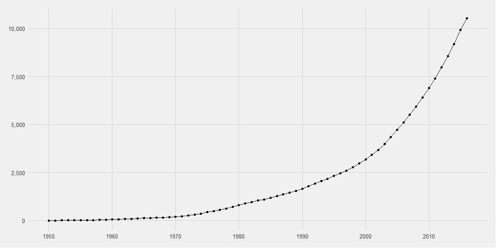
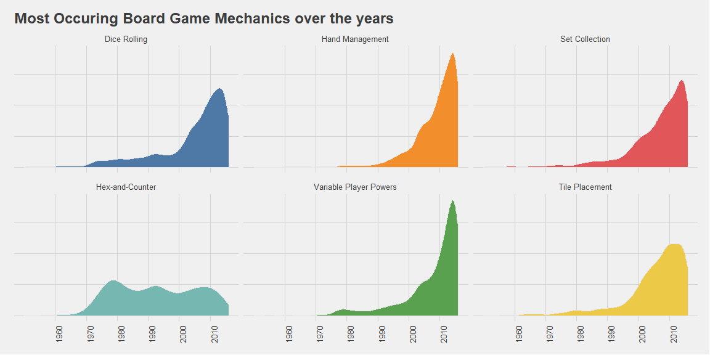

# Data Exploration Workflow

Load in the usual packages, and ggthemes so I can use the fivethrityeight ggplot2 theme.

```r
library(tidyverse)
library(lubridate)
library(ggthemes)

board_games <- read_csv("https://raw.githubusercontent.com/rfordatascience/tidytuesday/master/data/2019/2019-03-12/board_games.csv")
```

Let's get a look at the data.


```r
glimpse(board_games)
```

```
## Observations: 10,532
## Variables: 22
## $ game_id        <dbl> 1, 2, 3, 4, 5, 6, 7, 8, 9, 10, 11, 12, 13, 14, ...
## $ description    <chr> "Die Macher is a game about seven sequential po...
## $ image          <chr> "//cf.geekdo-images.com/images/pic159509.jpg", ...
## $ max_players    <dbl> 5, 4, 4, 4, 6, 6, 2, 5, 4, 6, 7, 5, 4, 4, 6, 4,...
## $ max_playtime   <dbl> 240, 30, 60, 60, 90, 240, 20, 120, 90, 60, 45, ...
## $ min_age        <dbl> 14, 12, 10, 12, 12, 12, 8, 12, 13, 10, 13, 12, ...
## $ min_players    <dbl> 3, 3, 2, 2, 3, 2, 2, 2, 2, 2, 2, 2, 3, 3, 2, 3,...
## $ min_playtime   <dbl> 240, 30, 30, 60, 90, 240, 20, 120, 90, 60, 45, ...
## $ name           <chr> "Die Macher", "Dragonmaster", "Samurai", "Tal d...
## $ playing_time   <dbl> 240, 30, 60, 60, 90, 240, 20, 120, 90, 60, 45, ...
## $ thumbnail      <chr> "//cf.geekdo-images.com/images/pic159509_t.jpg"...
## $ year_published <dbl> 1986, 1981, 1998, 1992, 1964, 1989, 1978, 1993,...
## $ artist         <chr> "Marcus Gschwendtner", "Bob Pepper", "Franz Voh...
## $ category       <chr> "Economic,Negotiation,Political", "Card Game,Fa...
## $ compilation    <chr> NA, NA, NA, NA, NA, NA, NA, NA, NA, NA, NA, NA,...
## $ designer       <chr> "Karl-Heinz Schmiel", "G. W. \"Jerry\" D'Arcey"...
## $ expansion      <chr> NA, NA, NA, NA, NA, NA, NA, NA, NA, "Elfengold,...
## $ family         <chr> "Country: Germany,Valley Games Classic Line", "...
## $ mechanic       <chr> "Area Control / Area Influence,Auction/Bidding,...
## $ publisher      <chr> "Hans im Glück Verlags-GmbH,Moskito Spiele,Vall...
## $ average_rating <dbl> 7.66508, 6.60815, 7.44119, 6.60675, 7.35830, 6....
## $ users_rated    <dbl> 4498, 478, 12019, 314, 15195, 73, 2751, 186, 12...
```

First off, I want to see the cumulative board game total count over the years.


```r
cumulative <- 
  board_games %>% 
  count(year_published) %>% 
  mutate(cumulative = cumsum(n))
```


```r
cumulative %>% 
  ggplot(aes(year_published, cumulative)) +
  geom_point() +
  geom_line() +
  scale_x_continuous(breaks = seq(1950, 2020, 10)) +
  scale_y_continuous(labels = scales::comma) +
  labs(x = "Year",
       y = "Cumulative No. of Board Games") +
  theme_fivethirtyeight()
```

<!-- -->
  
Looks like it started to pick up in the 70s and really got going exponential after 2000.

I want to do the same thing, but look at how the use of different game mechanics has changed over the years. A game mechanic is how a game is played like rolling dice, drawing, or storytelling. Let's take a look at the `mechanic` column.


```r
board_games %>% select(mechanic)
```

```
## # A tibble: 10,532 x 1
##    mechanic                                                                
##    <chr>                                                                   
##  1 Area Control / Area Influence,Auction/Bidding,Dice Rolling,Hand Managem~
##  2 Trick-taking                                                            
##  3 Area Control / Area Influence,Hand Management,Set Collection,Tile Place~
##  4 Action Point Allowance System,Area Control / Area Influence,Auction/Bid~
##  5 Hand Management,Stock Holding,Tile Placement                            
##  6 Dice Rolling                                                            
##  7 Area Enclosure,Pattern Building,Pattern Recognition,Tile Placement      
##  8 Modular Board                                                           
##  9 Area Control / Area Influence,Tile Placement                            
## 10 Card Drafting,Hand Management,Point to Point Movement,Route/Network Bui~
## # ... with 10,522 more rows
```

It looks like a board game can have multiple mechanic categories as we see here seperated by commas. What I need to do to analyze this type of data is force each row to have just one category while maintaining some contextual information. In this case I just want to keep a hold of the `year` column. Before we start, I'm just curious, what game had the most combinations of game mechanics?


```r
board_games %>% 
  select(year_published, name, mechanic) %>% 
  mutate(m_count = str_count(mechanic, ",")) %>%
  arrange(desc(m_count))
```

```
## # A tibble: 10,532 x 4
##    year_published name            mechanic                          m_count
##             <dbl> <chr>           <chr>                               <int>
##  1           2015 504             Area Control / Area Influence,Ar~      17
##  2           2014 Emperor's New ~ Acting,Action Point Allowance Sy~      14
##  3           2013 Patchistory     Action Point Allowance System,Ar~      11
##  4           2013 City of Remnan~ Action Point Allowance System,Ar~      10
##  5           2016 Pyramid Arcade  Area Control / Area Influence,Be~      10
##  6           2011 Mage Knight Bo~ Card Drafting,Co-operative Play,~       9
##  7           2012 Exodus: Proxim~ Area Control / Area Influence,Ar~       9
##  8           2015 Chaosmos        Action Point Allowance System,Ca~       9
##  9           2014 Sons of Anarch~ Action Point Allowance System,Ar~       9
## 10           1985 Advanced Squad~ Auction/Bidding,Dice Rolling,Hex~       8
## # ... with 10,522 more rows
```

504. Hmm, I'm not familier with it. Looks like settlers of catan after with a cash system after looking [here](https://boardgamegeek.com/image/2703890/504). Probably very complicated.

<br>

Now on to the data manipulation. I'll use `strsplit()` in a `mutate()` to serparate the categories and puts each of them into a nested tibble.


```r
mechanics_count <- 
  board_games %>% 
  select(year_published, mechanic) %>% 
  drop_na(mechanic) %>% 
  mutate(mechanic = strsplit(mechanic, ","))

mechanics_count
```

```
## # A tibble: 9,582 x 2
##    year_published mechanic 
##             <dbl> <list>   
##  1           1986 <chr [5]>
##  2           1981 <chr [1]>
##  3           1998 <chr [4]>
##  4           1992 <chr [4]>
##  5           1964 <chr [3]>
##  6           1989 <chr [1]>
##  7           1978 <chr [4]>
##  8           1993 <chr [1]>
##  9           1998 <chr [2]>
## 10           1998 <chr [4]>
## # ... with 9,572 more rows
```

To make this nested data useful, we simply use `unnest()`


```r
mechanics_count <- 
  mechanics_count %>% 
  unnest()

mechanics_count
```

```
## # A tibble: 23,950 x 2
##    year_published mechanic                     
##             <dbl> <chr>                        
##  1           1986 Area Control / Area Influence
##  2           1986 Auction/Bidding              
##  3           1986 Dice Rolling                 
##  4           1986 Hand Management              
##  5           1986 Simultaneous Action Selection
##  6           1981 Trick-taking                 
##  7           1998 Area Control / Area Influence
##  8           1998 Hand Management              
##  9           1998 Set Collection               
## 10           1998 Tile Placement               
## # ... with 23,940 more rows
```

Now we have all the game mechanics used with their corresponding year. Notice we went from 9.5K rows to 23.9K which is expected.


```r
mechanics_count %>%
  select(mechanic) %>% 
  unique() %>%
  drop_na(mechanic) %>%
  nrow()
```

```
## [1] 51
```

Before we get into plotting, I need to find the top 6 most occuring game mechanics. Having a total of 51 different game mechanics would make my plot hard to understand so let's keep it simple. 


```r
top_mechanics <- 
  mechanics_count %>% 
  count(mechanic, sort = T) %>% 
  top_n(n = 6, wt = n) %>% 
  pull(mechanic)

top_mechanics
```

```
## [1] "Dice Rolling"           "Hand Management"       
## [3] "Set Collection"         "Hex-and-Counter"       
## [5] "Variable Player Powers" "Tile Placement"
```

Perfet, now lets plot them using a faceted density plot.


```r
mechanics_count %>% 
  filter(mechanic %in% top_mechanics) %>% 
  mutate(mechanic = factor(mechanic, levels = top_mechanics)) %>% 
  ggplot(aes(year_published, fill = mechanic)) +
  geom_density(col = "grey90", show.legend = F) +
  facet_wrap(~mechanic, ncol = 3) +
  scale_x_continuous(breaks = seq(1960, 2010, 10)) +
  scale_fill_tableau() +
  labs(title = "Most Occuring Board Game Mechanics over the years") +
  theme_fivethirtyeight() +
  theme(axis.text.y = element_blank(),
        axis.text.x = element_text(angle = 90))
```

<!-- -->

All but one game mechanic seem to have rising in popularity rather quickly over the past two decades, while the Hex-and-Counter method has maintained a good share for for almost 40 years!

<br>
